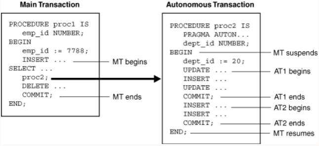

# 14 Design Considerations

## ✅Create standard constants and exceptions
Constants and exceptions are typically implemented using a bodiless package (that is, a package specification). Standardizing helps to:
- Develop programs that are consistent
- Promote a higher degree of code reuse
- Ease code maintenance
- Implement company standards across entire applications

Start with standardization of:
- Exception names
- Constant definitions

### Standardizing exceptions
Standardizing exceptions example: Create a standardized error-handling package that includes all named and programmer-defined exceptions to be used in the application

    create or replace package error_pkg is
        e_fk_err exception;
        e_seq_nbr_err exception;
        pragma exception_init (e_fk_err, -2292);
        pragma exception_init (e_seq_nbr_err, -2277);
        ...
    end error_pkg;

Standardizing exception handling example: Consider writing a subprogram for common exception handling to:
- Display errors based on `SQLCODE` and `SQLERRM` values for exceptions
- Track run-time errors easily by using parameters in your code to identify:
  - The procedure in which the error occurred
  - The location (line number) of the error
  - `RAISE_APPLICATION_ERROR` using stack trace capabilities, with the third argument set to TRUE

>Be careful when creating your own standardized exceptions, if you want to standardize existing oracle defined errors you can override the original error messages with your own. e.g. `declare e_fk_err exception; pragma EXCEPTION_INIT (e_fk_err, -02292);` Code -02292 is an existing oracle exception, when using `RAISE_APPLICATION_ERROR` with only 2 parameters, e.g. `RAISE_APPLICATION_ERROR(-20001, 'error')` the original message will be overwritten with 'error' (because the 3rd parameter defaults to false). Add 3rd parameter as true if you want to keep the original error message: `RAISE_APPLICATION_ERROR(-20001, 'error', true)`

### Standardizing constants
For programs that use local variables whose values should not change:
- Convert the variables to constants to reduce maintenance and debugging
- Create one central package specification and place all constants in it

## ✅Write and call local subprograms
A local subprogram is a `PROCEDURE` or `FUNCTION` defined at the end of the declarative section. e.g.

    CREATE PROCEDURE employee_sal(p_id number) IS
        v_emp employees%ROWTYPE;
        FUNCTION tax(p_salary VARCHAR2) RETURN NUMBER IS
        BEGIN
            RETURN p_salary * 0.825;
        END tax;
    BEGIN
        SELECT * INTO v_emp
        FROM EMPLOYEES WHERE employee_id = p_id;
        DBMS_OUTPUT.PUT_LINE('TAX: '||tax(v_emp.salary));
    END;
    /
    EXECUTE employee_sal(100);

Here the function *tax* is a local function:
- can be accessible only from the block owner
- compiled as a part of the owner block

Reason to use local subprograms:
- Reduction of repetitive code
- Code readability
- Easy maintenance

## ✅Control the run-time privileges of a subprogram
[IR, DR, AUTHID: 8.14](https://docs.oracle.com/en/database/oracle/oracle-database/19/lnpls/plsql-subprograms.html#GUID-41D23DE7-3C07-41CF-962B-F92B696594B5)

### Invoker's Rights and Definer's Rights (AUTHID Property)
- The `AUTHID` property of a stored PL/SQL unit affects the name resolution and privilege checking of SQL statements that the unit issues at run time. 
- It does not affect compilation, and has no meaning for units that have no code, such as collection types.
- Use data dictionary view `*_PROCEDURES` to see `AUTHID` property values. Values can be `CURRENT_USER, DEFINER, NULL`
- Stored PL/SQL units that can be created or altered with the following statements can use the optional `AUTHID` clause to specify either `DEFINER` (the default, for backwards compatibility) or `CURRENT_USER` (the preferred usage):
  - `CREATE FUNCTION`
  - `CREATE PACKAGE`
  - `CREATE PROCEDURE`
  - `CREATE TYPE`
  - `ALTER TYPE`
- A unit whose `AUTHID` value is `CURRENT_USER` is called an **invoker's rights unit**, or **IR unit**. Unit with `AUTHID` value `DEFINER` is called a **definer's rights unit**, or **DR unit**.
PL/SQL units and schema object for which you cannot specify an `AUTHID` value behave the following way:
  - Anonymous block behaves like an IR unit, `BEQUEATH CURRENT_USER` view only somewhat like IR unit
  - `BEQUEATH DEFINER` view and Trigger behave like a DR unit
- `AUTHID` affects both name resolution and privilege checking at run time:
  - context for name resolution is `CURRENT_SCHEMA`
  - privileges checked are those of the `CURRENT_USER` and the enabled roles.
- When a session starts, `CURRENT_SCHEMA` has the value of the schema owned by `SESSION_USER`, and `CURRENT_USER` has the same value as `SESSION_USER`. (Use `SYS_CONTEXT` function to get these values)
- `CURRENT_SCHEMA` can be changed with SQL: `ALTER SESSION SET CURRENT_SCHEMA`. 
- `CURRENT_USER` cannot be changed programatically but might change when PL/SQL unit or view is pushed onto, or popped from, the call stack.
- > Note: Oracle recommends against issuing `ALTER SESSION SET CURRENT_SCHEMA` from a stored PL/SQL unit
- During a server call, when a DR unit is pushed onto the call stack, the database stores the currently enabled roles and the current values of `CURRENT_USER` and `CURRENT_SCHEMA`. It then changes both `CURRENT_USER` and `CURRENT_SCHEMA` to the owner of the DR unit, and enables only the role `PUBLIC`
- `CURRENT_USER`, `CURRENT_SCHEMA` and enabled roles are changed when DR unit is pushed/popped from the call stack but not changed when IR unit is pushed/popped from the call stack (unless roles are granted to the IR unit itself)
- Dynamic SQL: name resolution and privilege checking are done once, at run time.
- Static SQL: name, resolution and privilege checking are done twice: first when the PL/SQL unit is compiled, and then again at run time. At compile time, the `AUTHID` property has no effect (both DR and IR units are treated like DR units). At run time `AUTHID` determines IR or DR.
- Upon entry into an IR unit, the runtime system checks privileges before doing any initialization or running any code. If the unit owner has neither the `INHERIT PRIVILEGES` privilege on the invoker nor the `INHERIT ANY PRIVILEGES` privilege, then the runtime system raises error `ORA-06598`.
- > Note: if the unit owner has the required privilege, then one of these statements granted it:
    `GRANT INHERIT PRIVILEGES ON current_user TO PUBLIC`
    `GRANT INHERIT PRIVILEGES ON current_user TO unit_owner`
    `GRANT INHERIT ANY PRIVILEGES TO unit_owner`

### Granting roles to PL/SQL packages and standalone subprograms
- Using the SQL `GRANT` command, you can grant roles to PL/SQL packages and standalone subprograms
- Roles granted to a PL/SQL unit do not affect compilation. They affect the privilege checking of SQL statements that the unit issues at run time: The unit runs with the privileges of both its own roles and any other currently enabled roles.
- Typically you grant roles to an IR unit, so that users with lower privileges than yours can run the unit with only the privileges needed to do so. 
- You grant roles to a DR unit (whose invokers run it with all your privileges) only if the DR unit issues dynamic SQL, which is checked only at run time.
- The basic syntax for granting roles to PL/SQL units is:

      GRANT role [, role ]... TO unit [, unit ]...
- Granting roles to PL/SQL units example:

      GRANT read, execute to FUNCTION hr.emp_function, PACKAGE sys.your_pkg

### IR units need template objects
- One user owns an IR unit and other users run it in their own schemas. 
- If the IR unit issues static SQL statements, then the schema objects that these statements affect must exist in the owner's schema at compile time (so that the compiler can resolve references) and in the invoker's schema at run time.
- The definitions of corresponding schema objects must match (e.g. corresponding tables must have the same names and columns); otherwise error or unexpected results. However, the objects in the owner's schema need not contain data, because the compiler does not need it; therefore they are called **template objects**.

### Connected user database links in DR units
- If you include a connected user database link in a DR unit, then you must grant the user who will run the DR unit the `INHERIT REMOTE PRIVILEGES` privilege.
- With this privilege the user can execute the DR unit, otherwise execution will fail with `ORA-25433: User does not have INHERIT REMOTE PRIVILEGES` error
- To include a connected user database link from within a definer's rights (DR) procedure, include `@database_link` in the procedure

## ✅Perform autonomous transactions
[Autonomous transactions: 6.7](https://docs.oracle.com/en/database/oracle/oracle-database/19/lnpls/static-sql.html#GUID-BC564905-51F4-4ADB-B300-9F15B1AC3099)

[Pragma AUTONOMOUS_TRANSACTION: 13.4](https://docs.oracle.com/en/database/oracle/oracle-database/19/lnpls/AUTONOMOUS_TRANSACTION-pragma.html)

- An **autonomous transaction** is an independent transaction started by another transaction, the main transaction. 
- Autonomous transactions do SQL operations and commit or roll back, without committing or rolling back the main transaction.
- Autonomous transaction control flow

- > Note: Although autonomous transaction is started by another transaction, it is not a nested transaction, because:
  >- It does not share transactional resources (such as locks) with the main transaction.
  >- It does not depend on the main transaction. (e.g. if main transaction rolls back, nested also rolls back, but autonomous does not)
  >- Its committed changes are visible to other transactions immediately (nested transaction committed changes not visible until main transaction commits)
  >- Exceptions raised in an autonomous transaction cause a transaction-level rollback, not a statement-level rollback.

**Advantages of autonomous transactions**
- After starting, an autonomous transaction is fully independent. It shares no locks, resources, or commit-dependencies with the main transaction. You can log events, increment retry counters, etc. even if the main transaction roll back.
- Autonomous transactions help you build modular, reusable software components. You can encapsulate autonomous transactions in stored subprograms. An invoking application does not need to know if operations done by that stored subprogram succeeded or failed.

**Transaction context**
- The main transaction shares its context with nested routines, but not with autonomous transactions.
- When one autonomous routine invokes another (or itself, recursively), the routines share no transaction context.
- When an autonomous routine invokes a nonautonomous routine, the routines share the same transaction context.

**Transaction visibility**
- Changes made by an autonomous transaction become visible to other transactions when the autonomous transaction commits. These changes become visible to the main transaction when it resumes, if its isolation level is set to `READ COMMITTED` (default).
- If you set the isolation level of the main transaction to `SERIALIZABLE`, changes made by its autonomous transactions are not visible to the main transaction when it resumes:

      SET TRANSACTION ISOLATION LEVEL SERIALIZABLE;
- >Note:
  >- Transaction properties apply only to the transaction in which they are set
  >- Cursor attributes are not affected by autonomous transactions.

**Declaring autonomous routines**
- To declare an autonomous routine, use the `AUTONOMOUS_TRANSACTION` pragma. 
- In this context, a **routine** is one of these:
  - Schema-level (not nested) anonymous PL/SQL block
  - Standalone, package, or nested subprogram
  - Method of a ADT (abstract datatype)
  - Noncompound trigger
- Example usage:
    
      CREATE OR REPLACE PROCEDURE increase_salary (emp_id NUMBER, amount NUMBER) AS
          PRAGMA AUTONOMOUS_TRANSACTION;
      BEGIN
          UPDATE employees
          SET salary = salary + amount
          WHERE employee_id = emp_id;

          COMMIT;
      END increase_salary;

**Controlling autonomous transactions**
- The first SQL statement in an autonomous routine begins a transaction. After one ends, the next SQL begins another transaction. All SQL statements run since the last commit or rollback comprise the current transaction
- To control autonomous transactions, use these statements, which apply only to the current (active) transaction:
  - `COMMIT`
  - `ROLLBACK [TO savepoint_name]`
  - `SAVEPOINT savepoint_name`
  - `SET TRANSACTION`

- Entering and exiting autonomous routines:
  - When you enter the executable section of autonomous routine, the main transaction suspends. When you exit the routine, the main transaction resumes.
  - If you try to exit an active autonomous transaction without committing or rolling back, the database raises an exception. If exception unhandled or transaction ends due to other unhandled exception, then the transaction rolls back.
  - To exit normally the routine must explicitly commit or roll back all autonomous transactions. If it (or any routine invoked by it) has pending transactions, then PL/SQL raises an exception and the pending transactions roll back.

- Committing and rolling back autonomous transactions:
  - Commit and rollback end the active autonomous transaction but do not exit the autonomous routine.
  - When one transaction ends, the next SQL statement begins another. Thus a single autonomous routine can contain several autonomous transactions, if it issues several commit statements.

- Savepoints:
  - The scope of a savepoint is the transaction in which it is defined. Savepoints defined in the main transaction are unrelated to those defined in its autonomous transactions. (they can in fact use the same names)
  - You can roll back only to savepoints marked in the current transaction. In an autonomous transaction, you cannot roll back to a savepoint marked in the main transaction. To do so, you must resume the main transaction by exiting the autonomous routine
  - When in the main transaction, rolling back to a savepoint marked before you started an autonomous transaction does not roll back the autonomous transaction. Autonomous transactions are fully independent of the main transaction.

- Avoiding errors with autonomous transactions:
  - If an autonomous transaction tries to access a resource held by the main transaction, a deadlock can occur. Database raises exception in the autonomous transaction, which rolls back if the exception is unhandled.
  - Database initialization parameter `TRANSACTIONS` specifies the maximum number of concurrent transactions. That number might be exceeded because an autonomous transaction runs concurrently with the main transaction.
  - If you try to exit an active autonomous transaction without committing or rolling back, the database raises an exception. If unhandled, transaction rolls back.
  - You cannot run `PIPE ROW` statement in an autonomous routine while an autonomous transaction is open. You must first close autonomous transaction before running `PIPE ROW`. This is normally accomplished by committing or rolling back the autonomous transaction before running the `PIPE ROW` statement

**Autonomous triggers**
- A trigger must be autonomous to run TCL or DDL statements
- To run DDL statements, the trigger must use native dynamic SQL

**Invoking autonomous functions from SQL**
- A function invoked from SQL statements must obey rules meant to control side effects.
- By definition, an autonomous routine never reads or writes database state (that is, it neither queries nor modifies any database table).

## ✅Use NOCOPY hint, PARALLEL ENABLE hint and DETERMINISTIC clause
[Subprogram parameter aliasing: 8.7.4.1](https://docs.oracle.com/en/database/oracle/oracle-database/19/lnpls/plsql-subprograms.html#GUID-1D93EBAE-406B-45CE-B89F-A456E37415CB)

[Formal parameter NOCOPY: 13.35](https://docs.oracle.com/en/database/oracle/oracle-database/19/lnpls/formal-parameter-declaration.html)

[PARALLEL_ENABLE: 13.47](https://docs.oracle.com/en/database/oracle/oracle-database/19/lnpls/PARALLEL_ENABLE-clause.html#GUID-CFF3C7D3-6438-44C2-9FAF-569F246C37CA)

[DETERMINISTIC: 13.23](https://docs.oracle.com/en/database/oracle/oracle-database/19/lnpls/DETERMINISTIC-clause.html)

### NOCOPY
- Requests that the compiler pass the corresponding actual parameter by reference instead of value. Each time the subprogram is invoked, the optimizer decides, silently, whether to obey or disregard `NOCOPY`
- > Caution: `NOCOPY` increases the likelihood of aliasing
  >- Aliasing is having two different names for the same memory location. If a stored item is visible by more than one path, and you can change the item by one path, then you can see the change by all paths.
  >- Subprogram parameter aliasing always occurs when the compiler passes an actual parameter by reference, and can also occur when a subprogram has cursor variable parameters.
- The compiler ignores `NOCOPY` in these cases:
  - The actual parameter must be implicitly converted to the data type of the formal parameter.
  - The actual parameters is the element of a collection.
  - The actual parameter is a scalar variable with the `NOT NULL` constraint
  - The actual parameter is a scalar numeric variable with a range, size, scale or precision constraint
  - The actual and formal parameters are records, one or both was declared with `%ROWTYPE` or `%TYPE`, and constraints on corresponding fields differ
  - The actual and formal parameters are records, the actual parameter was declared (implicitly) as the index of a cursor `FOR LOOP` statement, and constraints on corresponding fields differ
  - The subprogram is invoked through a database link or as an external subprogram
- When the compiler passes an actual parameter by reference, the actual and formal parameters refer to the same memory location. Therefore, if the subprogram changes the value of the formal parameter, the change shows immediately in the actual parameter.
- The compiler always passes `IN` parameters by reference, but the resulting aliasing cannot cause problems, because subprograms cannot assign values to `IN` parameters. 
- The compiler might pass an `OUT` or `IN OUT` parameter by reference, if you specify `NOCOPY` for that parameter
- `NOCOPY` is only a hint, each time the subprogram is invoked, the compiler decides, silently, whether to obey or ignore `NOCOPY`.
- Therefore, aliasing can occur for one invocation but not another, making subprogram results indeterminate. For example:
  - If the actual parameter is a global variable, then an assignment to the formal parameter might show in the global parameter ([Example 8-17](https://docs.oracle.com/en/database/oracle/oracle-database/19/lnpls/plsql-subprograms.html#GUID-1D93EBAE-406B-45CE-B89F-A456E37415CB__CIHBCCHI))
  - If the same variable is the actual parameter for two formal parameters, then an assignment to either formal parameter might show immediately in both formal parameters ([Example 8-18](https://docs.oracle.com/en/database/oracle/oracle-database/19/lnpls/plsql-subprograms.html#GUID-1D93EBAE-406B-45CE-B89F-A456E37415CB__CIHJIDAB))
  - If the actual parameter is a package variable, then an assignment to either the formal parameter or the package variable might show immediately in both the formal parameter and the package variable
  - If the subprogram is exited with an unhandled exception, then an assignment to the formal parameter might show in the actual parameter

### PARALLEL ENABLE
- Enables the function for parallel execution, making it safe for use in concurrent sessions of parallel DML evaluations
- Indicates that the function can run from a parallel execution server of a parallel query operation
- The `PARALLEL_ENABLE` clause can appear in the following SQL statements:
  - `CREATE FUNCTION`
  - `CREATE PACKAGE`
  - `CREATE TYPE BODY`
- The `PARALLEL_ENABLE` clause can appear only once in the function
- The function must not use session state, such as package variables, because those variables are not necessarily shared among the parallel execution servers
- Use the optional `PARTITION argument BY` clause only with a function that has a `REF CURSOR` data type. This clause lets you define the partitioning of the inputs to the function from the `REF CURSOR` argument. Partitioning the inputs to the function affects the way the query is parallelized when the function is used as a table function in the `FROM` clause of the query.
- You cannot specify `parallel_enable_clause` for a nested function. 

### DETERMINISTIC
- The deterministic option marks a function that returns predictable results and has no side effects.
- Function-based indexes, virtual column definitions that use PL/SQL functions, and materialized views that have query-rewrite enabled require special function properties. The `DETERMINISTIC` clause asserts that a function has those properties.
- The `DETERMINISTIC` option can appear in the following statements:
  - Function declaration and definition
  - `CREATE FUNCTION` statement
  - `CREATE PACKAGE` statement
  - `CREATE TYPE BODY` statement
- A function is deterministic if the `DETERMINISTIC` clause appears in either a declaration or the definition of the function. 
- The `DETERMINISTIC` clause may appear at most once in a function declaration and at most once in a function definition. 
- A deterministic function must return the same value on two distinct invocations if the arguments provided to the two invocations are the same. 
- A `DETERMINISTIC` function may not have side effects. 
- A `DETERMINISTIC` function may not raise an unhandled exception. 
- If a function with a `DETERMINISTIC` clause violates any of these semantic rules, the results of its invocation, its value, and the effect on its invoker are all undefined. 

**Usage**
- The `DETERMINISTIC` clause is an assertion that the function obeys the semantic rules. If the function does not, neither the compiler, SQL execution, or PL/SQL execution may diagnose the problem and wrong results may be silently produced.
- You must specify this keyword if you intend to invoke the function in the expression of a function-based index, in a virtual column definition, or from the query of a materialized view that is marked `REFRESH FAST` or `ENABLE QUERY REWRITE`. 
- When the database encounters a deterministic function, it tries to use previously calculated results when possible rather than reexecuting the function. If you change the function, then you must manually rebuild all dependent function-based indexes and materialized views.
- Do not specify `DETERMINISTIC` for a function whose result depends on the state of session variables or schema objects, because results might vary across invocations.
- Do not specify this clause to define a function that uses package variables or that accesses the database in any way that might affect the return result of the function.
- Specifying this clause for polymorphic table function is not allowed.
- When the `DETERMINISTIC` option appears, the compiler may use the mark to improve the performance of the execution of the function. 
- It is good programming practice to make functions that fall into these categories `DETERMINISTIC`: 
  - Functions used in a `WHERE, ORDER BY, or GROUP BY` clause 
  - Functions that `MAP` or `ORDER` methods of a SQL type
  - Functions that help determine whether or where a row appears in a result set

## ✅Use bulk binding and the RETURNING clause with DML
[Bulk binding, bulk sql: 12.4](https://docs.oracle.com/en/database/oracle/oracle-database/19/lnpls/plsql-optimization-and-tuning.html#GUID-61D1B533-DBB9-4150-91F9-0A4C9428391E)

[RETURNING INTO: 13.55](https://docs.oracle.com/en/database/oracle/oracle-database/19/lnpls/RETURNING-INTO-clause.html)

### Bulk SQL and Bulk Binding
- Bulk SQL minimizes the performance overhead of the communication between PL/SQL and SQL
- PL/SQL features that comprise bulk SQL are the `FORALL` statement and the `BULK COLLECT` clause
- Assigning values to PL/SQL variables that appear in SQL statements is called **binding**
- PL/SQL and SQL communicate as follows: To run a `SELECT INTO` or DML statement, the PL/SQL engine sends the query or DML statement to the SQL engine. The SQL engine runs the query or DML statement and returns the result to the PL/SQL engine
- The `FORALL` statement sends DML statements from PL/SQL to SQL in batches rather than one at a time
- The `BULK COLLECT` clause returns results from SQL to PL/SQL in batches rather than one at a time
- If a query or DML statement affects four or more database rows, then bulk SQL can significantly improve performance
- > Note: You cannot perform bulk SQL on remote tables
- PL/SQL binding operations fall into these categories:
  - **In-bind**: binding occurs When an `INSERT, UPDATE, or MERGE` statement stores a PL/SQL or host variable in the database 
  - **Out-bind**: binding occurs When the `RETURNING INTO` clause of an `INSERT, UPDATE, or DELETE` statement assigns a database value to a PL/SQL or host variable
  - **`DEFINE`**: binding occurs When a `SELECT` or `FETCH` statement assigns a database value to a PL/SQL or host variable
- For in-binds and out-binds, bulk SQL uses **bulk binding**; that is, it binds an entire collection of values at once
- For a collection of n elements, bulk SQL uses a single operation to perform the equivalent of n `SELECT INTO` or DML statements. A query that uses bulk SQL can return any number of rows, without using a `FETCH` statement for each one
- > Note: Parallel DML is disabled with bulk SQL

**FORALL Statement**
READ further