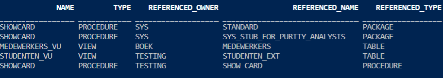
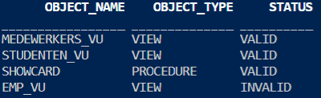

# 18 Managing Dependencies
[Understanding Schema Object Dependency - Oracle 19c Database Development Guide](https://docs.oracle.com/en/database/oracle/oracle-database/19/adfns/schema-object-dependency.html#GUID-488AF7D9-EDEB-4589-A503-FDE31CE55B60)
[\*_DEPENDENCIES: READ ONLY](https://docs.oracle.com/en/database/oracle/oracle-database/19/refrn/ALL_DEPENDENCIES.html#GUID-F9EA7DFB-5471-4B07-BDEF-FDE5DF57D1F4)
[DEPTREE: READ ONLY](https://docs.oracle.com/en/database/oracle/oracle-database/19/refrn/DEPTREE.html#GUID-92B4E327-4C55-4E34-B9BB-6F279656960B)
[IDEPTREE: READ ONLY](https://docs.oracle.com/en/database/oracle/oracle-database/19/refrn/IDEPTREE.html#GUID-B963715F-C7E0-44DE-9C76-8EE6DBE45AAE)
[\*_OBJECTS: READ ONLY](https://docs.oracle.com/en/database/oracle/oracle-database/19/refrn/ALL_OBJECTS.html#GUID-AA6DEF8B-F04F-482A-8440-DBCB18F6C976)

### Overview of Schema Object Dependency
- A dependency (in PL/SQL) is a reference from a stored program to some database object outside that program.
- Server-based PL/SQL programs can have dependencies on `tables, views, types, procedures, functions, sequences, synonyms, object types, package specifications, etc.` Program units are not, however, dependent on package bodies or object type bodies; these are the “hidden” implementations.
- Do not use the currently compiled version of a program if any of the objects on which it depends have changed since it was compiled.
- Some types of schema objects can reference other objects in their definitions, e.g. a view is defined by a query that references tables/views, and the body of a subprogram can include SQL statements that reference other objects
- If the definition of object A references object B, then A is a **dependent object** (of B) and B is a **referenced object** (of A)
- If you alter the definition of a referenced object, dependent objects might not continue to function without error, depending on the type of alteration. For example, if you drop a table, no view based on the dropped table is usable
- `CREATE` statements automatically update all dependencies
- Dynamic SQL statements do not create dependencies. For example, this statement does not create a dependency on tab1:

      EXECUTE IMMEDIATE 'SELECT * FROM tab1'

### Analyzing Dependencies with Data Dictionary Views, Querying Object Dependencies 
- Display dependent and referenced objects with: `USER_, ALL_, DBA_ DEPENDENCIES`
- The static data dictionary views `USER_DEPENDENCIES`, `ALL_DEPENDENCIES`, and `DBA_DEPENDENCIES` describe dependencies between database objects

      SELECT name, type, referenced_owner, referenced_name, referenced_type
      FROM USER_DEPENDENCIES;

- The database can only track dependencies of local stored objects written with static calls
- There are plenty of ways that you can create programs that do not appear in the `USER_DEPENDENCIES` view. These include external programs that embed SQL or PL/SQL, remote stored procedures or client-side tools that call local stored objects, and any programs that use dynamic SQL
- The utldtree.sql SQL script creates the view `DEPTREE`, which contains information on the object dependency tree, and the view `IDEPTREE`, a presorted, pretty-print version of `DEPTREE`

### Object status
- **Valid** - The object was successfully compiled, using the current definition in the data dictionary
- **Invalid** - The object is marked invalid because an object that it references has changed. (Only a dependent object can be invalid.)
- **Compiled with errors** - The most recent attempt to compile the object produced errors
- **Unauthorized** - An access privilege on a referenced object was revoked. (Only a dependent object can be unauthorized.)
- > Note: The static data dictionary views `USER_OBJECTS`, `ALL_OBJECTS`, and `DBA_OBJECTS` do not distinguish between "Compiled with errors," "Invalid," and "Unauthorized"—they describe all of these as `INVALID`

### Invalidation of dependent objects
- If object A depends on object B, which depends on object C, then A is a **direct dependent** of B, B is a direct dependent of C, and A is an **indirect dependent** of C
- Direct dependents are invalidated only by changes to the referenced object that affect them (changes to the signature of the referenced object).
- Indirect dependents can be invalidated by changes to the reference object that do not affect them. If a change to C invalidates B, it invalidates A (and all other direct and indirect dependents of B). This is called **cascading invalidation**. 
- With **coarse-grained invalidation**, a data definition language (DDL) statement that changes a referenced object invalidates all of its dependents. 
- With **fine-grained invalidation**, a DDL statement that changes a referenced object invalidates only dependents for which either of these statements is true:
  - The dependent relies on the attribute of the referenced object that the DDL statement changed.
  - The compiled metadata of the dependent is no longer correct for the changed referenced object.
- For example, if view v selects columns c1 and c2 from table t, a DDL statement that changes only column c3 of t does not invalidate v
- The DDL statement `CREATE OR REPLACE` object has no effect under these conditions: 
  - object is a PL/SQL object, the new PL/SQL source text is identical to the existing PL/SQL source text, and the PL/SQL compilation parameter settings stored with object are identical to those in the session environment
  - object is a synonym and the statement does not change the target object
- [Table with all fine-grained and coarse-grained invalidation](https://docs.oracle.com/en/database/oracle/oracle-database/19/adfns/schema-object-dependency.html#GUID-AEC8DF50-2AC2-4697-8CA9-F13108FBB810__G1008856)
- **Purity** refers to a set of rules for preventing side effects (such as unexpected data changes) when invoking PL/SQL functions within SQL queries. **Package purity** refers to the purity of the code in the package initialization block
- The **entry-point number** of a procedure or function is determined by its location in the PL/SQL package code. A procedure or function added to the end of a PL/SQL package is given a new entry-point number

Program units or objects may be invalidated if a change is made to the structure of the referenced object, one example is when a program unit uses `%ROWTYPE` and we modify or drop a column of the referenced table. Another simple example is as follows

    create table emp(id number);
    /
    create view emp_vu as select * from emp;
    /
    drop table emp;
    /
    select object_name, object_type, status 
    from user_objects;

> Note: Even if package body gets invalidated, as long as the specification doesn't change, program units that depend on the package will not be invalidated.

**Session State and Referenced Packages**
- Each session that references a package construct has its own instantiation of that package, including a persistent state of any public and private variables, cursors, and constants
- All of a session's package instantiations, including state, can be lost if any of the session's instantiated packages are subsequently invalidated and revalidated

**Security Authorization**
- When a data manipulation language (DML) object or system privilege is granted to, or revoked from, a user or PUBLIC, Oracle Database invalidates all the owner's dependent objects, to verify that an owner of a dependent object continues to have the necessary privileges for all referenced objects

### Guidelines for Reducing Invalidation
- To reduce invalidation of dependent objects, follow these guidelines:
  - Add Items to End of Package
    - When adding items to a package, add them to the end of the package. This preserves the entry point numbers of existing top-level package items, preventing their invalidation
  - Reference Each Table Through a View
    - Reference tables indirectly, using views, enabling you to:
      - Add columns to the table without invalidating dependent views or dependent PL/SQL objects
      - Modify or delete columns not referenced by the view without invalidating dependent objects
    - The statement `CREATE OR REPLACE VIEW` does not invalidate an existing view or its dependents if the new `ROWTYPE` matches the old `ROWTYPE`

### Revalidation of Objects
- An object that is not valid when it is referenced must be validated before it can be used. Validation occurs automatically when an object is referenced; it does not require explicit user action
- If an object is not valid, its status is either compiled with errors, unauthorized, or invalid
- Revalidation of Objects that Compiled with Errors:
    - The compiler cannot automatically revalidate an object that compiled with errors
    - The compiler recompiles the object, and if it recompiles without errors, it is revalidated; otherwise, it remains invalid
- Revalidation of Unauthorized Objects:
    - The compiler checks whether the unauthorized object has access privileges to all of its referenced objects. If so, the compiler revalidates the unauthorized object without recompiling it. If not, the compiler issues appropriate error messages
- Revalidation of Invalid SQL Objects:
    - The SQL compiler recompiles the invalid object. If the object recompiles without errors, it is revalidated; otherwise, it remains invalid
- Revalidation of Invalid PL/SQL Objects:
    - For an invalid PL/SQL program unit (procedure, function, or package), the PL/SQL compiler checks whether any referenced object changed in a way that affects the invalid object
    - If so, the compiler recompiles the invalid object. If the object recompiles without errors, it is revalidated; otherwise, it remains invalid
    - If not, the compiler revalidates the invalid object without recompiling it

**Recompilation**
- No PL/SQL program marked as `INVALID` will run until a successful recompilation changes its status to `VALID`. 
- Recompilation can happen in one of three ways:
  - Automatic runtime recompilation (when program unit is called)
  - `ALTER ... COMPILE` recompilation
  - Schema-level recompilation:
    - `utlip.sql`
    - `utlrp.sql`
    - `utlrcmp.sql`
    - `DBMS_UTILITY.COMPILE_SCHEMA`
    - `UTL_RECOMP`

### Local Dependency Management
- **Local dependency management** occurs when Oracle Database manages dependencies among the objects in a single database. For example, a statement in a procedure can reference a table in the same database. 

### Remote Dependency Management
- **Remote dependency management** occurs when Oracle Database manages dependencies in distributed environments across a network. For example, an Oracle Forms trigger can depend on a schema object in the database. In a distributed database, a local view can reference a remote table
- Oracle Database also manages distributed database dependencies. For example, an Oracle Forms application might contain a trigger that references a table. The database system must account for dependencies among such objects
- Oracle Database uses different mechanisms to manage remote dependencies, depending on the objects involved

**Dependencies Among Local and Remote Database Procedures**