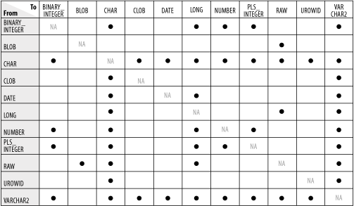

# 2 Writing Executable Statements

## ✅Identify lexical units in a PL/SQL block
[Lexical units: 2.2](https://docs.oracle.com/en/database/oracle/oracle-database/19/lnpls/plsql-language-fundamentals.html#GUID-8854493A-E242-4473-9B17-01F489ABC371)

The **lexical units** of plsql are its smallest individual components: delimiters, identifiers, literals, pragmas, and comments

#### Delimiters
- a **delimiter** is a character, or character combination, that has special meaning in plsql
- do no embed any other characters (including whitespace characters) inside a delimiter
- delimiters in plsql:

      +         :=          =>          %           '           .           ||          /      
      **        ()          :           ,           <<>>        /**/        *           "
      ..        =           <>          !=          ~=          ^=          <           >
      <=        >=          @           --          ;           -

#### Identifiers
see topic 1: declaring variables

#### Literals
- a **literal** is a value that is neither represented by an identifier nor calculated from other values
e.g. 123 is an integer literal and 'abc' is a character literal, but 1+2 is not a literal
- plsql includes all sql literals and boolean literals (which sql does not have)
- character literals in plsql 
  - are case-sensitive: 'Z' and 'z' are different
  - whitespaces are significant: 'abc', ' abc', 'a b c' are different
  - plsql has no line-continuation character, meaning if you continue a string on the next source line, then the string includes a line-break character:

        dbms_output.put_line('this string breaks
        here');
        -- this will output:
        this string breaks
        here
    if string does not fit on source line and you don't want to include line-break then construct string with concatenation operator (||)
  - '0' through '9' are not equivalent to the integer literals 0 through 9, however because plsql converts them to integers you can use them in arithmetic expressions
  - character literal with zero characters has the value null and is called a **null string**, however this null value is not the boolean null
  - an **ordinary character literal** is composed of characters in the **database character set**
  - a **national character literal** is composed of characters in the **national character set**

#### Pragmas
- a **pragma** is an instruction to the compiler that is processes at compile time
- a pragma begins with the reserved word `PRAGMA` followed by the name of the pragma. Some pragmas have arguments, some may appear before a declaration or a statement, some may have additional restrictions applied
- a pragma whose name or argument is not recognized by the compiler has no effect
- some of the most prominent pragmas:
  - autonomous_transaction
  - coverage
  - deprecate
  - exception_init
  - inline
  - restrict_references
  - serially_reusable
  - udf

#### Comments
- the plsql compiler ignores comments, their purpose is to help other application developers understand your source text or to disable obsolete or unfinished piecees of code
- **single-line comments** begin with -- and extend to the end of the line
  > do not put a single-line comment in a plsql block to be processed dynamically by an oracle precompiler program. The precompiler program ignores end-of-line characters, which means that a single-line comment ends when the block ends
- **multi-line comments** begin with /* and en with */, and can span multiple lines
  - be careful not to cause nested multiline comments, one multiline comment cannot contain another multiline comment, but can contain single-line comments

#### Whitespace characters between lexical units
You can put whitespace characters between lexical units, whhich could make your source text easier to read

## ✅Use built-in SQL functions in PL/SQL and sequences in PL/SQL expressions
[Expressions, SQL Functions: 2.7](https://docs.oracle.com/en/database/oracle/oracle-database/19/lnpls/plsql-language-fundamentals.html#GUID-42674F8E-55C3-44D5-BA42-47B323CD74F5)

[Sequence currval and nextval in PL/SQL: 7.1.2.1](https://docs.oracle.com/en/database/oracle/oracle-database/21/lnpls/static-sql.html#GUID-68348EB4-62D0-4D86-A056-8BDC0CB50187)

### Expressions and SQL functions
- An expression is a combination o fone or more values, operators, and sql functions that evaluates to a value. 
- An expression always returns a single value, simplest expressions in order of increasing complexity are:
  1. a single constant or variable (e.g. `a`);
  2. a unary operator and its single operand (e.g. `-a`)
  3. a binary operator and its two operands (e.g. `a+b`)
- An operand can be a variable, constant, literal, operator, function invocation, or placeholder, or another expression.
- The data types of the operands etermine the data type of the expression. Every time the expression is evaluated, a single value of that data type results. The data type of that result is the data type of the expression

#### Concatenation
- the concatenation operator (||) appends one string to another
- it ignores null operands

#### Operator precedence
- an operation is either a unary operator and its single operand or a binary operator and its two operands
- the operations in an expression are evaluated in order of operator precedence
  - **
  - +, - (unary)
  - *, /
  - +, -, || (binary)
  - =, <, >, <=, >=, <>, !=, ~=, ^=, IS NULL, LIKE, BETWEEN, IN
  - NOT
  - AND
  - OR
- to control the order of evaluation, enclose operations in parentheses. When parentheses are nested, the most deeply nested operations are evaluated first

#### Logical operators
- the logical operators `AND, OR, and NOT` follow a tri-state logic. `AND` an `OR` are binary, `NOT` is unary
- `AND` returns true if and only if both operands are true, `OR` returns true if either op is true, `NOT` returns the opposite of its operand

#### Short-circuit evaluation
- when evaluating logical expression, plsql uses short-circuit evaluation, that is, plsql stops evaluating the expression as soon as it can determine the result.
- therefore you can write expressions that might otherwise cause errors
e.g. declare zero integer := 0; begin if (zero = 0) or (10 / zero < 5) then ... end if; ...
in above example the left operand is true so plsql does not evaluate the right operand in if statement, so no divide by zero error

#### Comparison operators
- comparison operators compare one expression to another. The result is always either `TRUE, FALSE, or NULL`. 
- if the value of one expression is `NULL`, then the result of the comparison is also `NULL`. 
- comparison operators are:
  - IS [NOT] NULL
  - relational operators: =, <>, <, >, <=, >=
  - LIKE
  - BETWEEN
  - IN

#### Boolean expressions
- a `BOOLEAN` expression is an expression that returns a `BOOLEAN` value: `TRUE, FALSE, or NULL`. 
- the simplest `BOOLEAN` expression is a `BOOLEAN` literal, constant, or variable. The following are also `BOOLEAN` expressions: 

      NOT boolean_expression
      boolean_expression relational_operator boolean_expression
      boolean_expression { AND | OR } boolean_expression

- typically you use `BOOLEAN` expression as condition in control statements and in `WHERE` cluases of DML statements
- you can use a `BOOLEAN` variable itself as a condition, you need not compare it to the value `TRUE` or `FALSE`

#### Case expressions
- simple case expression:
`case selector when selector_value then result ...`
- searched case expression:
`case when boolean_expression then result ...`

#### SQL functions in PL/SQL expressions
In plsql expressions you can use all sql functions except:
- aggregate functions (`avg`, `count`, etc.)
- analytic functions (`lag`, ratio_to_report, etc.)
- data mining functions (cluster_id, feature_value, etc.)
- encoding and decoding functions (`decode`, dump, etc.)
- model functions (iteration_number, previous, etc.)
- object reference functions (ref, value, etc.)
- xml functions
- these conversion functions:
  - bin_to_num
- these json sql operators:
  - json_arrayagg
  - json_equal
  - json_objectagg
  - json_table
  - json_textcontains
- these collation sql operators and functions:
  - collate
  - collation
  - nls_collation_id
  - nls_collation_name
- these miscellaneous functions:
  - cube_table
  - dataobj_to_partition
  - `lnnvl`
  - `nvl2`
  - sys_connect_by_path
  - sys_typeid
  - width_bucket
- plsql supports an overload of bitand for which the arguments and result are binary_integer
- when used in plsql, the rawtohex function accepts an argument of datatype raw and returns a varchar2 value with the hexadecimal representations of bytes that comprise the value of the argument

#### Static expressions
- a static expression is an expression whose value can be determined at compile time, that is, it does not include character comparisons, variables, or function invocations
- static expressions are the only expressions that can appear in conditional compilation directives
- definition:
  - an expression is static if it is the null literal
  - an expression is static if it is a character, numeric or boolean literal
  - an expression is static if it is a reference to a static constant
  - an expression is static if it is a reference to a conditional compilation variable begun with $$
  - an expression is static if it is an operator allowed in static expressions, if all of its operands are static, and if the operator does not raise an exception when it is evaluated on those operands

### CURRVAL and NEXTVAL in PL/SQL
- after a sequence is created, you can access its values in sql statements with the currval pseudocolumn, which returns the current value of the sequence, or the nextval pseudocolumn whihc increments the sequence and returns the new value
- you can use the `sequence_name.currval` and `sequence_name.nextval` in a plsql expression wherever you can use a number expression, however:
  - using them to provide a default value for an abstract data type method parameter causes a compilation error
  - plsql evaluates every occurrence of them (unlike sql, which evaluates a sequence expression for every row in which it appears)

## ✅Describe when implicit conversions take place and when explicit conversions have to be dealt with
[Datatype conversion 10g](https://docs.oracle.com/cd/B19306_01/appdev.102/b14261/datatypes.htm#i9118)

[Datatype conversion oreilly](https://www.oreilly.com/library/view/oracle-plsql-programming/0596003811/ch07s05.html)

### Explicit conversion
- to convert values from one datatype to another, you use built-in conversion functions
- using explicit conversions, particularly when passing parameters to subprograms, can avoid unexpected or wrong results

### Implicit conversion
- when it makes sense, plsql can convert the datatype of a value implicitly. This lets you use literals, variables, and parameters of one type where another type is expected
- before assigning a selected column value to a variable, plsql will, if necessary, convert the value from the datatype of the source column to the datatype of the variable. This happens, for example, when you select a date column value into a varchar2 variable
- likewise, before assigning the value of a variable to a database column, plsql will, if necessary, convert the value from the datatype of the variable to the datatype of the target column. If plsql cannot determine which implicit conversion is needed, you get a compilation error. In such cases you must use a datatype conversion function

Implicit conversions plsql can do

- notes: 
  - the pls_integer and binary_integer datatypes are identical so no conversion takes place
  - the tables lists only types that have different representations. Types that have the same representation, such as clob and nclob, char and nchar, and varchar2 and nvarchar2 can be substituted for each other
  - you can implicitly convert between clob and nclob, but be careful because this can be an expensive operation
  - `TIMESTAMP, TIMESTAMP WITH TIME ZONE, TIMESTAMP WITH LOCAL TIME ZONE, INTERVAL DAY TO SECOND, and INTERVAL YEAR TO MONTH` can all be converted using the same rules as the `DATE` type. However, because of their different internal representations, these types cannot always be converted to each other
  - It is your responsibility to ensure that values are convertible. For instance, PL/SQL can convert the CHAR value '02-JUN-92' to a `DATE` value but cannot convert the `CHAR` value 'YESTERDAY' to a `DATE` value. Similarly, PL/SQL cannot convert a `VARCHAR2` value containing alphabetic characters to a `NUMBER` value
- relying on implicit datatype conversions is a poor programming practice because they can be slower and teh conversion rules might change in later software releases
- implicit conversions are context-sensitive and not always predictable. For best reliability and maintainability, use datatype conversion functions

## ✅Write nested blocks and qualify variables with labels
[Block](https://docs.oracle.com/en/database/oracle/oracle-database/19/lnpls/block.html#GUID-9ACEB9ED-567E-4E1A-A16A-B8B35214FC9D)

[Scope and visibility: 2.5](https://docs.oracle.com/en/database/oracle/oracle-database/19/lnpls/plsql-language-fundamentals.html#GUID-2FC17012-FC99-4614-90DD-ADC99F2EDBE9)

### Block
- the block, which groups related declarations and statements, is the basic unit of a plsql source program
- it has as **optional declarative part**, a **required executable part**, and an **optional exception-handling part**
- declarations are local to the block and cease to exist when the block completes execution
- blocks can be nested
- an anonymous block is an executable statement
- basic syntax:

      [declare declare_section]
      begin statement
      [exception exception_handler]
      end [name];

- advanced syntax:
      
      [<< label >>]
      [declare
        {item_list_1 [item_list_2] | item_list_2}
      ]
      begin
        [<< label >>]
        statement
      [exception
        exception_handler
      ]
      end [name];

      -- item list 1
      {type_definition | cursor_declaration | item_declaration | function_declaration | procedure_declaration}
      -- item list 2
      {cursor_declaration | cursor_definition | function_declaration | function_definition | procedure_declaration | procedure_definition}
      -- type definition
      {collection_type | record_type | ref_cursor_type | subtype}
      -- subtype definition
      subtype subtype_identifier is base_type [{constraint | character set character_set}] [not null]
      -- constraint
      {precision [, scale] | range low_value .. high_value}
      -- item declaration
      {collection_variable | constant | cursor_variable | exception | record_variable | variable}

- declare section restrictions:
  - a declare_section in `create package`, `create package body`, or `compound trigger block` cannot include `pragma autonomous_transaction`
- subtype tips:
  - do not specify constraint if base_type is not a numeric datatype
  - do not specify precision if base_type cannot specify precision
  - do not specify scale if base_type cannot specify scale
  - specify range clause only if base_type is pls_integer or a subtype of pls_integer (either predefined or user-defined)
- label is an undeclared identifier unique for the block

### Scope and visibility of identifiers
- the **scope** of an identifier is the region of a plsql unit from which you can reference the identifier
- the **visibility** of an identifier is the region of a plsql unit from which you can reference the identifier without qualifying it
- an identifier is **local** to the plsql unit that declares it, if that unit has subunits then the identifier is **global** to them
- if a subunit redeclares a global identifier, then inside the subunit, both identifiers are in scope, but only the local identifier is visible. To reference the global identifier, the subunit must qualify it with the name of the unit that declared it. If that unit has no name, then the subunit cannot reference the global identifier
- a plsql unit cannot reference identifiers declared in other units at the same level, because those identifiers are neither local nor global to the block
- you cannot declare the same identifier twice in the same plsql unit. If you do, an error occurs when you reference the duplicate identifier
- you can declare the same identifier in two different units. The two objects represented by the identifier are distinct, changing one doesn't affect the other
- in the same scope, give labels and subprograms unique names to avoid confusion and unexpected results
- in the next example the outer block was given a label so global identifiers a and b can be qualified in the subblocks

      <<outer>>
      declare 
          a number := 1;
          b number := 2;
      begin
          declare
              a number := 11;
          begin
              declare 
                  b number := 22;
              begin
                  dbms_output.put_line(outer.a || ' ' || b);
              end;
              dbms_output.put_line(a || ' ' || outer.b);
          end;
      end;
      /
      --output 
      1 22
      11 2

## ✅Write readable code with appropriate indentation
[Coding style](https://trivadis.github.io/plsql-and-sql-coding-guidelines/v4.0/3-coding-style/coding-style/)

[Indentation standards](http://www.dba-oracle.com/t_plsql_indentation_standards.htm)

READ