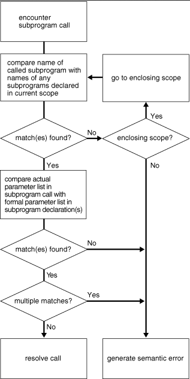

# 8 Using PL/SQL Subprograms

## ✅Differentiate between anonymous blocks and subprograms
[Subprogram overview: 8](https://docs.oracle.com/en/database/oracle/oracle-database/19/lnpls/plsql-subprograms.html#GUID-13BEBBEC-02D4-48E8-A059-DFEAC4751A3B)

[Types of subprogram: 8.2](https://docs.oracle.com/en/database/oracle/oracle-database/19/lnpls/plsql-subprograms.html#GUID-E03F512B-1A30-43B4-8DCA-64DA68AE7CE4)

[Subprogram properties: 8.4](https://docs.oracle.com/en/database/oracle/oracle-database/19/lnpls/plsql-subprograms.html#GUID-F4B0F4E1-90F4-4432-8DCF-3C93D0376E88)

[Subprogram parts: 8.5](https://docs.oracle.com/en/database/oracle/oracle-database/19/lnpls/plsql-subprograms.html#GUID-855AA11F-32CB-4CAD-9255-BE92A6821487)

[Side effects: 8.11](https://docs.oracle.com/en/database/oracle/oracle-database/19/lnpls/plsql-subprograms.html#GUID-6C6A828F-8FA0-4278-97D2-6D5649A66A9A)

### Overview
- A PL/SQL subprogram is a named PL/SQL block that can be invoked repeatedly
- If the subprogram has parameters, their values can differ for each invocation
- A subprogram is either a procedure or a function
- Typically, you use a procedure to perform an action and a function to compute and return a value

### Types of subprograms
- You can create a subprogram either inside a PL/SQL block (which can be another subprogram), inside a package, or at schema level
- A subprogram created inside a PL/SQL block is a **nested subprogram**
  - You can either declare and define it at the same time, or you can declare it first and then define it later in the same block (forward declaration)
  - A nested subprogram is stored in the database only if it is nested in a standalone or package subprogram
- A subprogram created inside a package is a **package subprogram**
  - You declare it in the package specification and define it in the package body
  - It is stored in the database until you drop the package
- A subprogram created at schema level is a **standalone subprogram**
  - You create it with the `CREATE FUNCTION` or `CREATE PROCEDURE` statement
  - It is stored in the database until you drop it with the `DROP FUNCTION` or `DROP PROCEDURE` statement
  - [These SQL statements are described here](https://docs.oracle.com/en/database/oracle/oracle-database/19/lnpls/sql-statements-for-stored-plsql-units.html#GUID-C918310F-F1BB-41D7-9466-B558B70DDFFE)
- A **stored subprogram** is either a package subprogram or a standalone subprogram
  - A stored subprogram is affected by the `AUTHID` and `ACCESSIBLE BY` clauses, which can appear in the `CREATE FUNCTION`, `CREATE PROCEDURE`, and `CREATE PACKAGE` statements
  - The `AUTHID` clause affects the name resolution and privilege checking of SQL statements that the subprogram issues at run time
  - The `ACCESSIBLE BY` clause specifies a white list of PL/SQL units that can access the subprogram

### Subprogram properties
- Each subprogram property can appear only once in the subprogram declaration
- The properties can appear in any order
- Properties appear before the `IS` or `AS` keyword in the subprogram heading
- The properties cannot appear in nested subprograms
- Only the `ACCESSIBLE BY` property can appear in package subprograms
- Standalone subprograms may have the following properties in their declaration
  - `ACCESSIBLE BY` Clause
  - `DEFAULT COLLATION` Clause
  - Invoker's Rights and Definer's Rights (`AUTHID` Property)

### Subprogram parts
- A subprogram begins with a **subprogram heading**, which specifies its name and (optionally) its parameter list.
- **Declarative part (optional)**
  - This part declares and defines local types, cursors, constants, variables, exceptions, and nested subprograms. These items cease to exist when the subprogram completes execution
  - This part can also specify pragmas
  - > Note: The declarative part of a subprogram does not begin with the keyword `DECLARE`, as the declarative part of an anonymous block does, but with the keyword `AS` or `IS` right after the subprogram heading
- **Executable part (required)**
  - This part contains one or more statements that assign values, control execution, and manipulate data
  - (Early in the application design process, this part might contain only a `NULL` statement)
- **Exception-handling part (optional)**
  - This part contains code that handles runtime errors

### Subprogram side effects
- A subprogram has side effects if it changes anything except the values of its own local variables
- For example, a subprogram that changes any of the following has side effects:
  - Its own `OUT` or `IN OUT` parameter
  - A global variable
  - A public variable in a package
  - A database table
  - The database
  - The external state (by invoking `DBMS_OUTPUT` or sending e‐mail, for example)
- Side effects can prevent the parallelization of a query, yield order-dependent (and therefore, indeterminate) results, or require that package state be maintained across user sessions
- Minimizing side effects is especially important when defining a result-cached function or a stored function for SQL statements to invoke

## ✅Create a simple procedure and invoke it from an anonymous block
[Subprogram invocation: 8.3](https://docs.oracle.com/en/database/oracle/oracle-database/19/lnpls/plsql-subprograms.html#GUID-C04B6BF9-1B19-42F9-82D8-CA137E97A024)

[Subprogram invocation resolution: 8.8](https://docs.oracle.com/en/database/oracle/oracle-database/19/lnpls/plsql-subprograms.html#GUID-A7D51201-1711-4F33-827F-70042700801F)

### Subprogram invocations
- A subprogram invocation has this form: 
`subprogram_name [ ( [ parameter [, parameter]... ] ) ]`
- If the subprogram has no parameters, or specifies a default value for every parameter, you can either omit the parameter list or specify an empty parameter list
- A procedure invocation is a PL/SQL statement. For example:
`raise_salary(employee_id, amount);`
- A function invocation is an expression. For example:
`new_salary := get_salary(employee_id);`
`IF salary_ok(new_salary, new_title) THEN ...`

### Subprogram invocation resolution
- When the PL/SQL compiler encounters a subprogram invocation, it searches for a matching subprogram declaration—first in the current scope and then, if necessary, in successive enclosing scopes
- A declaration and invocation match if their subprogram names and parameter lists match. The parameter lists match if each required formal parameter in the declaration has a corresponding actual parameter in the invocation
- If the compiler finds no matching declaration for an invocation, then it generates a semantic error
- Figure: how plsql compiler resolves invocations

## ✅Identify benefits of subprograms
[Reasons to use subprograms: 8.1](https://docs.oracle.com/en/database/oracle/oracle-database/19/lnpls/plsql-subprograms.html#GUID-56B4253C-6113-4C97-A0D2-1488B6526076)

[Overloading: 8.9](https://docs.oracle.com/en/database/oracle/oracle-database/19/lnpls/plsql-subprograms.html#GUID-47D5A50E-7AAF-4C80-A06A-37593EA2526A)

[Recursion: 8.10](https://docs.oracle.com/en/database/oracle/oracle-database/19/lnpls/plsql-subprograms.html#GUID-E093EF16-0477-44B4-B3E2-37D7CEF4F25C)

[External subprograms: 8.15](https://docs.oracle.com/en/database/oracle/oracle-database/19/lnpls/plsql-subprograms.html#GUID-96B5DE2B-D809-4296-9CDE-B317B81895F8)

### Reasons to use subprograms
Subprograms support the development and maintenance of reliable, reusable code with the following features:
- **Modularity**
Subprograms let you break a program into manageable, well-defined modules
- **Easier Application Design**
When designing an application, you can defer the implementation details of the subprograms until you have tested the main program, and then refine them one step at a time. (To define a subprogram without implementation details, use the NULL statement)
- **Maintainability**
You can change the implementation details of a subprogram without changing its invokers
- **Packageability**
Subprograms can be grouped into packages
- **Reusability**
Any number of applications, in many different environments, can use the same package subprogram or standalone subprogram
- **Better Performance**
Each subprogram is compiled and stored in executable form, which can be invoked repeatedly. Because stored subprograms run in the database server, a single invocation over the network can start a large job. This division of work reduces network traffic and improves response times. Stored subprograms are cached and shared among users, which lowers memory requirements and invocation overhead
- Subprograms are an important component of other maintainability features, such as packages and Abstract Data Types

### Overloading subprograms
- PL/SQL lets you overload nested subprograms, package subprograms, and type methods
- You can use the same name for several different subprograms if their formal parameters differ in name, number, order, or data type family. A data type family is a data type and its subtypes
- If formal parameters differ only in name, then you must use named notation to specify the corresponding actual parameters
- Take the following example: two subprograms are defined with the same name, *initialize*. The procedures initialize different types of collections (one `TABLE OF DATE` and one `TABLE OF NUMBER`). Because the processing in the procedures is the same, it is logical to give them the same name
  - You can put the two *initialize* procedures in the same block, subprogram, package, or type body
  - PL/SQL determines which procedure to invoke by checking their formal parameters
  - The version of *initialize* that PL/SQL uses depends on whether you invoke the procedure with a `TABLE OF DATE` type or a `TABLE OF NUMBER` type

**Formal parameters that differ only in numeric data type**
- You can overload subprograms if their formal parameters differ only in numeric data type
- This technique is useful in writing mathematical application programming interfaces (APIs), because several versions of a function can use the same name, and each can accept a different numeric type
- For example, a function that accepts `BINARY_FLOAT` might be faster, while a function that accepts `BINARY_DOUBLE` might be more precise
- To avoid problems or unexpected results when passing parameters to such overloaded subprograms:
  - Ensure that the expected version of a subprogram is invoked for each set of expected parameters. For example, if you have overloaded functions that accept `BINARY_FLOAT` and `BINARY_DOUBLE`, which is invoked if you pass a `VARCHAR2` literal like '5.0'?
  - Qualify numeric literals and use conversion functions to make clear what the intended parameter types are. For example, use literals such as 5.0f (for `BINARY_FLOAT`), 5.0d (for `BINARY_DOUBLE`), or conversion functions such as `TO_BINARY_FLOAT`, `TO_BINARY_DOUBLE`, and `TO_NUMBER`
- PL/SQL looks for matching numeric parameters in this order:
  1. `PLS_INTEGER` (or `BINARY_INTEGER`, an identical data type)
  2. `NUMBER`
  3. `BINARY_FLOAT`
  4. `BINARY_DOUBLE`
- A `VARCHAR2` value can match a `NUMBER`, `BINARY_FLOAT`, or `BINARY_DOUBLE` parameter
- PL/SQL uses the first overloaded subprogram that matches the supplied parameters. For example, the SQRT function takes a single parameter. There are overloaded versions that accept a NUMBER, a BINARY_FLOAT, or a BINARY_DOUBLE parameter. If you pass a PLS_INTEGER parameter, the first matching overload is the one with a NUMBER parameter
- The SQRT function that takes a NUMBER parameter is likely to be slowest. To use a faster version, use the TO_BINARY_FLOAT or TO_BINARY_DOUBLE function to convert the parameter to another data type before passing it to the SQRT function
- If PL/SQL must convert a parameter to another data type, it first tries to convert it to a higher data type. For example:
  - The ATAN2 function takes two parameters of the same type. If you pass parameters of different types—for example, one PLS_INTEGER and one BINARY_FLOAT—PL/SQL tries to find a match where both parameters use the higher type. In this case, that is the version of ATAN2 that takes two BINARY_FLOAT parameters; the PLS_INTEGER parameter is converted upwards
  - A function takes two parameters of different types. One overloaded version takes a PLS_INTEGER and a BINARY_FLOAT parameter. Another overloaded version takes a NUMBER and a BINARY_DOUBLE parameter. If you invoke this function and pass two NUMBER parameters, PL/SQL first finds the overloaded version where the second parameter is BINARY_FLOAT. Because this parameter is a closer match than the BINARY_DOUBLE parameter in the other overload, PL/SQL then looks downward and converts the first NUMBER parameter to PLS_INTEGER

**Subprograms that you cannot overload**
You cannot overload these subprograms:
- Standalone subprograms
- Subprograms whose formal parameters differ only in mode; for example:
`PROCEDURE s (p IN  VARCHAR2) IS ...`
`PROCEDURE s (p OUT VARCHAR2) IS ...`
- Subprograms whose formal parameters differ only in subtype; for example:
`PROCEDURE s (p INTEGER) IS ...`
`PROCEDURE s (p REAL) IS ...`
INTEGER and REAL are subtypes of NUMBER, so they belong to the same data type family
- Functions that differ only in return value data type, even if the data types are in different families; for example:
`FUNCTION f (p INTEGER) RETURN BOOLEAN IS ...`
`FUNCTION f (p INTEGER) RETURN INTEGER IS ...`

**Subprogram overload errors**
- The PL/SQL compiler catches overload errors as soon as it determines that it cannot tell which subprogram was invoked. When subprograms have identical headings, the compiler catches the overload error when you try to compile the subprograms themselves (if they are nested) or when you try to compile the package specification that declares them. Otherwise, the compiler catches the error when you try to compile an ambiguous invocation of a subprogram
- [See the examples](https://docs.oracle.com/en/database/oracle/oracle-database/19/lnpls/plsql-subprograms.html#GUID-ACE7A3B5-CF77-47C7-ACAD-B2D7BC729D45)

### Subprogram recursion
- A recursive subprogram invokes itself. Recursion is a powerful technique for simplifying an algorithm
- A recursive subprogram must have at least two execution paths—one leading to the recursive invocation and one leading to a terminating condition. Without the latter, recursion continues until PL/SQL runs out of memory and raises the predefined exception `STORAGE_ERROR`
- Each recursive invocation of a subprogram creates an instance of each item that the subprogram declares and each SQL statement that it executes
- A recursive invocation inside a cursor `FOR LOOP` statement, or between an `OPEN` or `OPEN FOR` statement and a `CLOSE` statement, opens another cursor at each invocation, which might cause the number of open cursors to exceed the limit set by the database initialization parameter `OPEN_CURSORS`
- example, recursive function return n factorial (n!):

      CREATE OR REPLACE FUNCTION factorial (
        n POSITIVE
      ) RETURN POSITIVE
        AUTHID DEFINER
      IS
      BEGIN
        IF n = 1 THEN                 -- terminating condition
          RETURN n;
        ELSE
          RETURN n * factorial(n-1);  -- recursive invocation
        END IF;
      END;
      /
      BEGIN
        FOR i IN 1..5 LOOP
          DBMS_OUTPUT.PUT_LINE(i || '! = ' || factorial(i));
        END LOOP;
      END;
      /

### External subprograms
- If a C procedure or Java method is stored in the database, you can publish it as an external subprogram and then invoke it from PL/SQL
- To publish an external subprogram, define a stored PL/SQL subprogram with a call specification. The call specification maps the name, parameter types, and return type of the external subprogram to PL/SQL equivalents. Invoke the published external subprogram by its PL/SQL name
- e.g. suppose java method is stored in database, define call specification

      CREATE OR REPLACE PROCEDURE java_sleep (milli_seconds IN NUMBER)
      AS LANGUAGE JAVA NAME 'java.lang.Thread.sleep(long)';