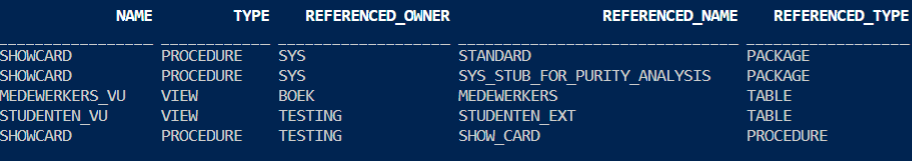
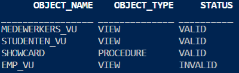

# Managing Dependencies
### References:
- Oracle PL/SQL Programming, 6th ed. by S. Feuerstein, Chapter 20.2
- [Understanding Schema Object Dependency - Oracle 19c Database Development Guide](https://docs.oracle.com/en/database/oracle/oracle-database/19/adfns/schema-object-dependency.html#GUID-488AF7D9-EDEB-4589-A503-FDE31CE55B60)

## Overview
A dependency (in PL/SQL) is a reference from a stored program to some database object outside that program.

Server-based PL/SQL programs can have dependencies on `tables, views, types, procedures, functions, sequences, synonyms, object types, package specifications, etc.` Program units are not, however, dependent on package bodies or object type bodies; these are the “hidden” implementations.

>Do not use the currently compiled version of a program if any of the objects on which it depends have changed since it was compiled.

Some types of shcema objects can reference other objects in their definitions, e.g. a view is defined by a query that references tables/views.

>If the definition of object A references object B, then A is a **dependent object** (of B) and B is a **referenced object** (of A).

## Analyzing Dependencies with Data Dictionary Views
Display dependent and referenced objects:
USER_, ALL_, DBA_ DEPENDENCIES

    select name, type, referenced_owner, referenced_name, referenced_type
    from user_dependencies;

The database can only track dependencies of local stored objects written
with static calls. 

There are plenty of ways that you can create programs that do not appear in the USER_DEPENDENCIES view. These include external programs that embed SQL
or PL/SQL, remote stored procedures or client-side tools that call local stored objects, and any programs that use dynamic SQL.

## Object status
Valid - successfully compiled, using current data dict definition

Invalid - object that it references has changed

Compiled with errors - most recent attempt produced errors

Unauthorized - access privilege on referenced object was revoked

## Invalidation of dependent objects
>If object A depends on object B, which depends on object C, then A is a direct dependent of B, B is a direct dependent of C, and A is an indirect dependent of C. 

- Direct dependents are invalidated only by changes to the referenced object that affect them (changes to the signature of the referenced object).

- Indirect dependents can be invalidated by changes to the reference object that do not affect them. If a change to C invalidates B, it invalidates A (and all other direct and indirect dependents of B). This is called cascading invalidation. 

- With coarse-grained invalidation, a data definition language (DDL) statement that changes a referenced object invalidates all of its dependents. 

- With fine-grained invalidation, a DDL statement that changes a referenced object invalidates only dependents for which either of these statements is true:
    
    - The dependent relies on the attribute of the referenced object that the DDL statement changed.
    
    - The compiled metadata of the dependent is no longer correct for the changed referenced object.

Program units or objects may be invalidated if a change is made to the structure of the referenced object, one example is when a program unit uses %ROWTYPE and we modify or drop a column of the referenced table. Another simple example is as follows

    create table emp(id number);
    /
    create view emp_vu as select * from emp;
    /
    drop table emp;
    /
    select object_name, object_type, status 
    from user_objects;

> Note: Even if package body gets invalidated, as long as the specification doesn't change, program units that depend on the package will not be invalidated.

## Revalidation of Objects
- Compiled with errors:
    - cannot automatically revalidate, must recompile without errors
- Unauthorized:
    - compiler checks access privileges, if does have, revalidates without recompiling
- Invalid SQL:
    - if recompile without errors then revalidate
- Invalid PL/SQL:
    - compiler checks whether any referenced object changed in a way that affects the invalid object. If so, the compiler recompiles the invalid object. If the object recompiles without errors, it is revalidated; otherwise, it remains invalid. If not, the compiler revalidates the invalid object without recompiling it.

No PL/SQL program marked as INVALID will run until a successful recompilation changes its status to VALID. Recompilation can happen in one of three ways:
- Automatic runtime recompilation (when program unit is called)
- ALTER ... COMPILE recompilation
- Schema-level recompilation:
    - utlip.sql
    - utlrp.sql
    - utlrcmp.sql
    - DBMS_UTILITY.COMPILE_SCHEMA
    - UTL_RECOMP

## Local and Remote 
- Local dependency management occurs when Oracle Database manages dependencies among the objects in a single database. For example, a statement in a procedure can reference a table in the same database. 

- Remote dependency management occurs when Oracle Database manages dependencies in distributed environments across a network.
